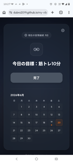

# 習慣管理アプリ (shukan-app)



## 📖 概要

`shukan-app` は、シンプルで見た目にもこだわった **習慣管理 Web アプリ** です。ユーザーは今日の目標を設定して完了ボタンを押すだけで達成を記録でき、ストリークや月間カレンダーで進捗を直感的に確認できます。

## ✨ 主な機能

- 目標テキストの設定・編集
- 完了ボタンで達成状況を表示
- `canvas-confetti` による祝福アニメーション
- 連続達成日数（ストリーク）の表示
- 月間カレンダーへの達成マーク
- ローカルストレージによるデータ永続化
- リセットボタンでデモやテストが簡単
- レスポンシブ対応でスマホでも使いやすい

## 🛠 前提条件・インストール

**環境**
- Node.js 18 以上
- npm または yarn

**インストール手順**
1. `shukan-app` フォルダに移動
   ```bash
   cd /home/yutaka/src/github/my-vibe-agravs/shukan-app
   ```
2. 依存パッケージをインストール
   ```bash
   npm install
   ```

> `package.json` には Vite が devDependency として登録されています。

## 🚀 起動・使い方

### 1. GitHub Pages で開く（推奨）
以下の URL にアクセスしてください。
- https://dubro2019.github.io/my-vibe-agravs/shukan-app/www/


### 2. 開発サーバーを起動
```bash
npm run dev
```

その後、ブラウザで `http://localhost:5173` にアクセスします。

### 使い方
1. 右上の歯車アイコンをクリックして目標を設定
2. 「完了」ボタンを押すと達成が記録され、バナーと confetti が表示される
3. カード上部でストリークを確認
4. カレンダーで達成日を確認
5. 左下の「ステータスをリセット」で初期状態に戻す

### 3. 本番ビルド（任意）
```bash
npm run build
```

ビルド後は `dist/` 内の静的ファイルを任意のサーバーで配信できます。

## 🧰 テックスタック

| カテゴリ | 使用技術 |
|----------|----------|
| 言語 | HTML5, CSS3, JavaScript (ES2022) |
| フレームワーク | Vite |
| デザイン | カスタム CSS、ガラスモーフィズム、アニメーション |
| フォント | Google Fonts (Noto Sans JP, Plus Jakarta Sans) |
| ライブラリ | canvas-confetti |
| パッケージ管理 | npm |

## 📂 ディレクトリ構成

```
shukan-app/
├─ package.json
├─ package-lock.json
├─ README.md
├─ screen_image.png
├─ www/          # アプリ本体
└─ ...

```

## 📄 ライセンス
MIT ライセンス。自由に改変・再配布できます。

---
**Powered by Antigravity** – your AI‑assisted development partner.

