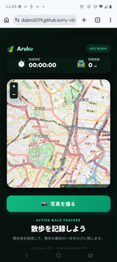

# Aruku — 散歩ログ & GPS



## 📖 概要
**Aruku** は、美しく設計されたシンプルな散歩トラッキング Web アプリです。
スマートフォンのブラウザでの利用を想定したモバイルファースト設計で、深緑（Forest & Active Tech）を基調としたプレミアムなデザインが特徴です。

ブラウザ標準の Geolocation API と高機能地図ライブラリ「Leaflet」を組み合わせ、リアルタイムな現在地取得、ルート記録、写真のマップマッピング、そして過去の履歴保存をすべてサーバーレス（クライアントサイドのみ）で実現しています。

## ✨ 主な機能
- **リアルタイムトラッキング**: `watchPosition` を用いた高精度な位置情報取得とルートのポリライン描画。
- **直感的なダッシュボード**: 経過時間、歩行距離をリアルタイムに計算して表示。
- **フォト・マッピング**: 散歩中に撮影した写真をその場所の地図上にサムネイルとしてマッピング（位置情報の紐付け）。
- **ローカル履歴管理**: 外部サーバーを一切使わず、ブラウザの `localStorage` を利用して過去の散歩ログを安全に保存・一覧表示。
- **洗練された UI/UX**: グラスモルフィズム（ガラス風デザイン）を取り入れた、夜間でも見やすいダークグリーンのプレミアムテーマ。
- **堅牢なエラーハンドリング**: GPS信号のロストや、ユーザーの位置情報許可拒否に対して、分かりやすいカスタムトーストで通知。

## 🛠 動作環境
特別なバックエンドサーバーやビルド環境（Node.js等）は必要ありません。最新のモダンブラウザ（Safari, Chrome, Edge など）が動作する環境であれば、PC・スマートフォン問わず動作します。

- 必須：位置情報（GPS）の利用許可
- ライブラリ（CDN経由で自動読み込み）：Leaflet.js 1.9.4


### 1. GitHub Pages で今すぐ試す（推奨）
以下の公開 URL にアクセスするだけで、すぐにアプリを利用できます。
- https://dubro2019.github.io/my-vibe-agravs/walking-app/


### 2. ローカル環境で実行する
本リポジトリをクローンまたはダウンロードし、`index.html` をブラウザで開くだけで動作します。

**手順:**
1. リポジトリをクローン
   ```bash
   git clone [https://github.com/dubro2019/my-vibe-agravs.git](https://github.com/dubro2019/my-vibe-agravs.git)
   cd my-vibe-agravs/walking-app

2.実行する

index.html を直接ブラウザにドラッグ＆ドロップする。

または、VS Code の拡張機能「Live Server」等を利用してローカルホストで起動する。

もし live-server（npm）をお持ちの場合は、以下でも起動可能です：

Bash
npx live-server .


👣 画面の操作方法

「🎯 現在地を取得」ボタン
現在の位置情報を取得し、地図の中心を移動させます。

「🥾 散歩を始める」ボタン
トラッキングを開始します。移動するにつれて地図上にグリーンのルートが描画され、時間と距離がカウントされます。

「📸 写真を撮る / 保存」
現在の位置にピンを立て、撮影した写真（または画像）を地図上にマッピングします。

「🏁 散歩を終了」ボタン
トラッキングを停止し、今回の散歩の「合計時間」と「合計距離」のサマリーを表示します。データは自動的に「過去の履歴」に蓄積されます。


## 🧰 テックスタック & 構成

### 主要ファイル
- **`index.html`** — アプリ本体の構造を定義する HTML ファイル
- **`script.js`** — すべてのクライアントサイドロジック（Geolocation API による位置情報取得、Leaflet.js のマップ制御、localStorage による履歴管理など）
- **`style.css`** — 深緑を基調としたプレミアムな UI デザイン、グラスモルフィズム、トースト通知などのレイアウトとスタイル

### 外部依存（CDN 経由）
- **Leaflet.js (v1.9.4)** — 軽量かつ高機能なオープンソースのインタラクティブ地図ライブラリ
- **Google Fonts** — デザイン性を高めるためのプレミアムフォント（`Noto Sans JP` および `Outfit`）の読み込み


## 📂 ディレクトリ構成

```
walking-app/
├─ index.html
├─ script.js
├─ style.css
└─ README.md
```

## ⚠️ 注意事項 & 今後の展望

### 既知の注意点
- **位置情報の許可**: 本アプリの動作にはブラウザの位置情報（GPS）利用許可が必須です。許可がない場合、トラッキングやマッピングなどのコア機能が制限されます。
- **通信環境**: 地図データの読み込み（Leaflet CDN）にインターネット接続が必要です。

### 今後の推奨改善案（ロードマップ）
アプリのさらなる実用性向上のため、以下の機能を将来的な改善案として検討しています。
- **オフライン対応 (PWA化)**: 電波の届きにくい場所でもルートを一時保持できるように改善。
- **データの外部書き出し**: 記録したルートデータを GPX や GeoJSON 形式でエクスポートする機能。
- **クラウド同期**: データの永続化や複数端末での共有のため、バックエンドサーバーまたは Firebase 等との連携。


## 📄 ライセンス
MIT ライセンス。自由に改変・再配布できます。

---
**Powered by Antigravity** – your AI‑assisted development partner.

